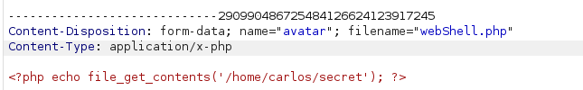

# Web shell upload via Content-Type restriction bypass

In the description, the line **It attempts to prevent users from uploading unexpected file types, but relies on checking user-controllable input to verify this.** is noticeable.

Now, let's upload the shell and analyze the request in the burp.

while uploding webShell.php file, we are receiving the following error:

**Sorry, file type application/x-php is not allowed Only image/jpeg and image/png are allowed**.

Now, lets try to manipulate the headers will allowed types mentioned in this message. See the image below:

Here, change the value of header `Content-Type` to one of the allowed value such as `image/jpeg`. Now, send the request again using burpsuite.

Yeah Got it! File has been uploaded. Now trigger the file through your browser at path `/file/avatars/webShell.php`. 

##### Boom! Got the desired value.