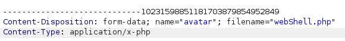

# Web shell upload via path traversal

I went to my account and entered the provided credentials **username=wiener and password=peter**. And then I shown up a page where there was option to upload an image.

This is the point where we can upload our web shell to read the file **/home/carlos/secret**. 

Firstly, we need create the payload, that is:

```php
<?php echo file_get_contents('/home/carlos/secret'); ?>
```

save it into a .php file and upload it. 

Now, make sure your burpsuite is open and actively capturing the requests in http proxy tab. Then open your account of the lab and then go to http proxy tab in burpsuite. Capture the request in burpsuite and analyze the request:



You need to add `../` before the value of file name like `filename=../webShell.php` and then send the request, you will see the following response: **The file avatars/webShell.php has been uploaded.**. By analyzing this response we can predict that webShell.php is still inside the avatars directory. It means server is stripping the directory traversal sequence. 

### Lets try another way

Now, use encoding like `filename=..%2fwebShell.php`. Now send the request and analyze the response. Response is: **The file avatars/../webShell.php has been uploaded.**. It suggests that our path traversal is successfull and file is stored in another directory now. Another thing needs to be noticed that server is URL decoding the filename.

Now, make a GET request to trigger this shell through your browser on the path `your-lab-link/files/avatar/../webShell.php`

##### Boom! Got the desired value.