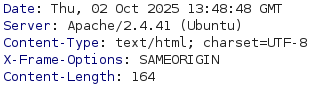
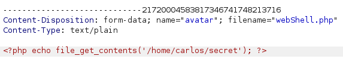

# Web shell upload via extension blacklist bypass

I uploaded the webshell.php file but server gave me the following response:

`Sorry, php files are not allowed
Sorry, there was an error uploading your file.`

Now, I tried to upload .php5 file and it uploaded successfully. But when I tried to access it via browser using the path files/avatars/webshell.php, server returns empty file. Means our shell is not being executed. In technical words, there is configuration at server side that such files must not be executed. 

Now, our task is to execute our file. To do so we need to change the configuration. This is the phase where we needs reconnaissance. If we use burpsutie then we can find the server that is deployed.

See the server header in the response in above picture that shows apache server is deployed. And we know that .htaccess file is commonly used for configurations.

Now, intercept the request to upload a file and modifyt the request. See the image below:

Change the name of `filename=.htaccess`, `content-type=text/plain` and replace this red line of php with the line: `AddType application/x-httpd-php .ot`. It means that any .ot file will be executed as same as php files are. 

Also upload your webshell.ot and try to access it via browser. 

##### Boom! We got our desired value.